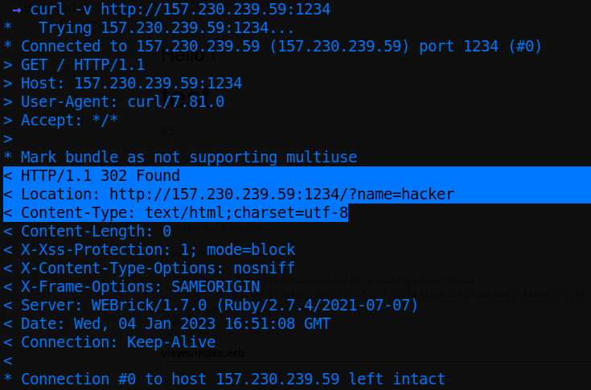
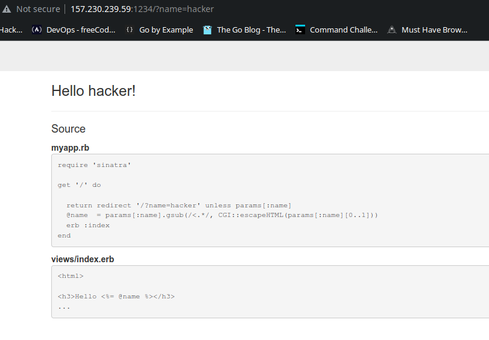
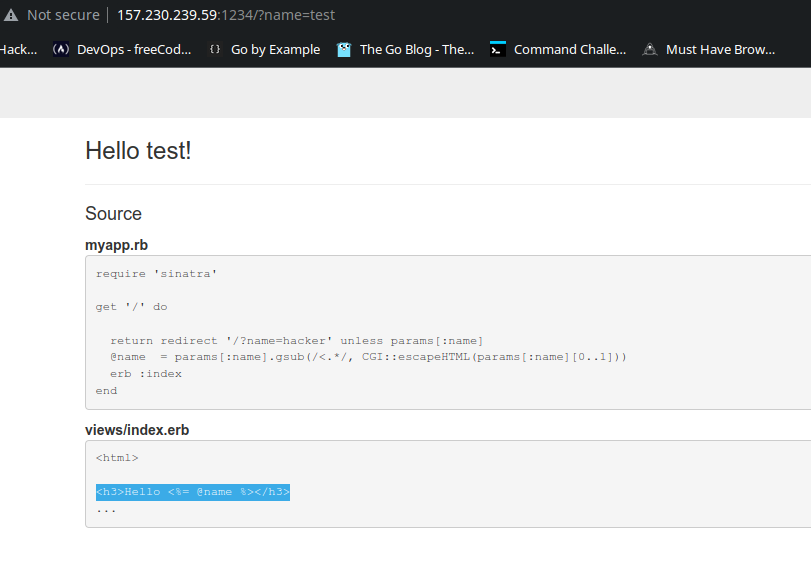
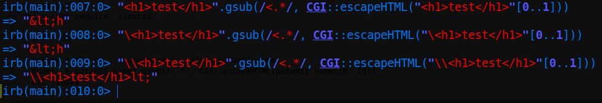
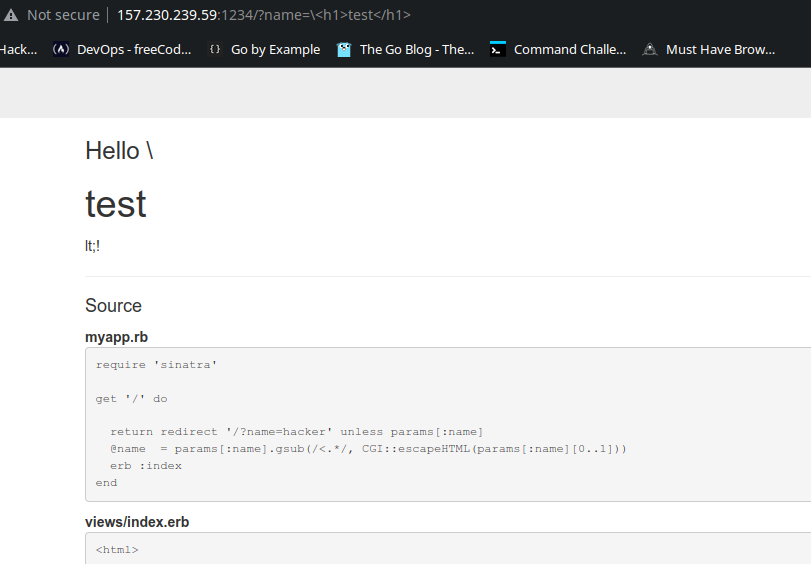
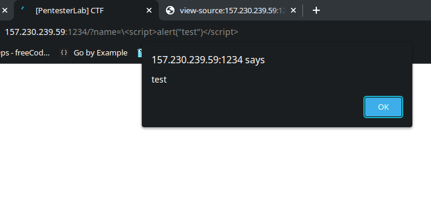

# Writeup for the given challenge @ Twitter

* Given website - `http://157.230.239.59:1234`
* After we visit, redirected to `http://157.230.239.59:1234/?name=hacker`...redirection can be verified via curl:<br>


* The interface is clear that it is a **Ruby-Sinatra** application, Sinatra a mini framework for Ruby backend. The `name` parameter takes an input which is shown in the page:


* So, clearly if the value is changed from *hacker* to anything like *test*, it displays it. Hence, it is clear in order to get an XSS we need to change here.

* Now, if tried with some payload like: `<h1>test</h1>`...it is sanitized out with this:
```ruby
@name  = params[:name].gsub(/<.*/, CGI::escapeHTML(params[:name][0..1]))
```

* Here `gsub` is a Ruby method that substitutes **anything** that matches the pattern in first argument with the replacement in second argument. Here the first argument is the pattern that matches anything that comes after "<". So, a payload like `<h1>test</h1>` is clearly substituted out.
* Now most importantly the second argument uses
```ruby
CGI::escapeHTML(params[:name][0..1])
```
which is basically the first 2 characters of the payload, in this case its `<h`
* Finally it becomes, the whole payload, `<h1>test</h1>` is replaced with `&lt;h` where `&lt;` is a literal for less than.
* Now we can test some basic changes in the payload like this:


* It's clear since the replacement occurs only with first 2 characters, we can add an extra `\` in the beginning, which works fine:

* According to the Ruby documentation, it is the expected behaviour:(from https://ruby-doc.org/core-2.7.0/doc/regexp_rdoc.html and https://www.rubydoc.info/stdlib/core/String:gsub)

```
Similarly, \&, \', \`, and + correspond to special variables, $&, $', $`, and $+, respectively. (See regexp.rdoc for details.) \0 is the same as \&. \\ is interpreted as an escape, i.e., a single backslash. Note that, within replacement the special match variables, such as $&, will not refer to the current match.
```

* Finally the `<h1>` tags can be changed to `<script>` tags to get an alert box:


* Final payload: `\<script>alert("test")</script>`
